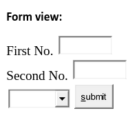

- Roll number: 
- Name:

# Practical 1 - Building a simple calculator

- Create a new Java Web application in Netbeans IDE
- Name the application to something like “TYIT”
- Click Next
- Select Glassfish server
- Click Next and Finish (do not add any frameworks)

*index.html*
```html

<!DOCTYPE html>
<html>
  <head>
    <title>calculator</title>
  </head>
  <body>
    <form action='Calculator' method='get'>
      First No. <input type="text" name="t1"><br>
      Second No. <input type="text" name="t2"><br>

      <select id="drop" name='t3'>
        <option value="1">add</option>
        <option value="2">sub</option>
        <option value="3">div</option>
        <option value="4">multi</option>
      </select>

      <input type='submit' value="submit">

    </form>
  </body>
</html>
```



- Create a new Servlet “Calculator.java” in the default source package
*Calculator.java*

```java

@WebServlet(urlPatterns = {"/Calculator "})
public class Calculator extends HttpServlet {
    protected void processRequest(
        HttpServletRequest request,
        HttpServletResponse response
    )
        throws ServletException, IOException {
            response.setContentType("text/html;charset=UTF-8");
            try (PrintWriter out = response.getWriter()) {
                /* TODO output your page here. You may use following sample code. */
                out.println("<!DOCTYPE html>");
                out.println("<html>");
                out.println("<head>");
                out.println("<title>Servlet NewServlet</title>");            
                out.println("</head>");
                out.println("<body>");
                int a=Integer.parseInt(request.getParameter("t1"));
                int b=Integer.parseInt(request.getParameter("t2"));
                int opt=Integer.parseInt(request.getParameter("t3"));

                switch(opt) {
                    case 1 :
                        out.println("<h1>Addition of the given numbers: "+(a+b)+"</h1>");
                        break;
                    case 2 :
                        out.println("<h1>Subtracion of the given numbers: "+(a-b)+"</h1>");
                        break;
                    case 3 :
                        out.println("<h1>Division of the given numbers: "+(a/b)+"</h1>");
                        break;
                    case 4 :
                        out.println("<h1>Multiplication of the given numbers: "+(a*b)+"</h1>");
                        break;    

                }
                out.println("</body>");
                out.println("</html>");
            }
        }
    // Doget and Dopost methods
}
```

- Build and run the project by pressing the green play button.
- Go to http://localhost:8080/TYIT/index.html
- Enter any number in number 1 and number 2, select any operator like add, Hit submit, you’ll be taken to this screen


