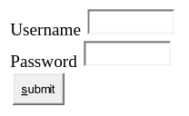

- Roll number: 
- Name:

# Practical 2 - Building a simple login form

- Create a new Java Web application in Netbeans IDE
- Name the application to something like “TYIT”
- Click Next
- Select Glassfish server
- Click Next and Finish (do not add any frameworks)

*index.html*
```html
<!DOCTYPE html>
<html>
  <head>
    <title>login form</title>
  </head>
  <body>
    <form action="NewServlet" method="get">
      Username <input type="text" name="u"><br>
      Password <input type="text" name="p"><br>     

      <input type="submit" value="submit">

    </form>
  </body>
</html>
```



- Create a new Servlet “NewServlet.java” in the default source package
*NewServlet.java*

```java
@WebServlet(urlPatterns = {"/NewServlet"})
public class NewServlet extends HttpServlet {

    protected void processRequest(HttpServletRequest request, HttpServletResponse response)
            throws ServletException, IOException {
        response.setContentType("text/html;charset=UTF-8");
        try (PrintWriter out = response.getWriter()) {
            /* TODO output your page here. You may use following sample code. */
            out.println("<!DOCTYPE html>");
            out.println("<html>");
            out.println("<head>");
            out.println("<title>Servlet NewServlet</title>");            
            out.println("</head>");
            out.println("<body>");
            String user = request.getParameter("u");
            String pass = request.getParameter("p");
            if (pass.equalsIgnoreCase("sys"))
                out.println("<h1>Hello "+user+"</h1>");
            else
            out.println("<h1>login failed</h1>");
            out.println("</body>");
            out.println("</html>");
        }
    }
}
```

This is to be created in the default source package

- Save all files and then right click the java file and select “Run file”
- You will be taken to the browser
- Enter any username and password
- Click login

*Output*


